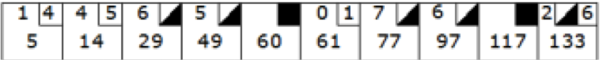
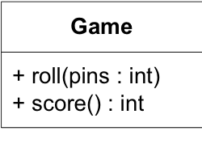
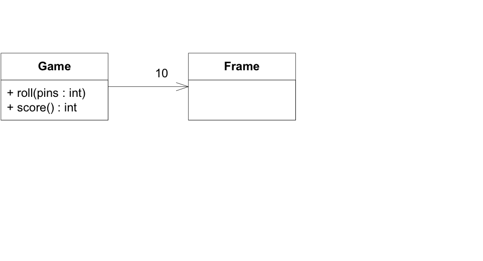
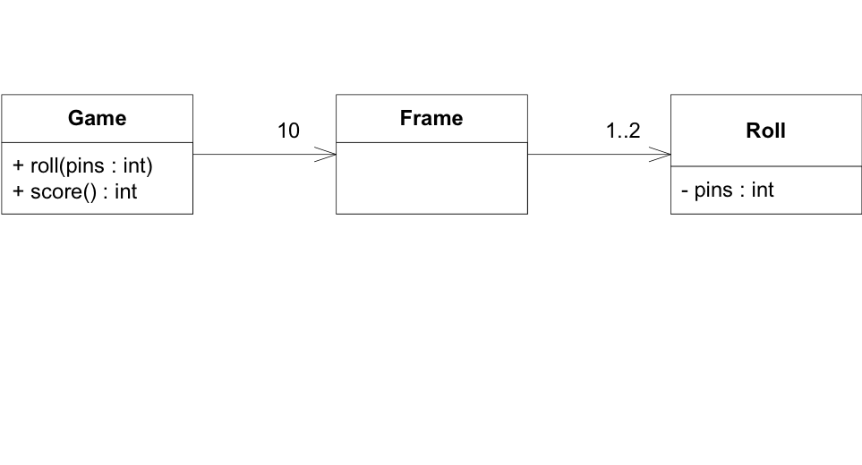
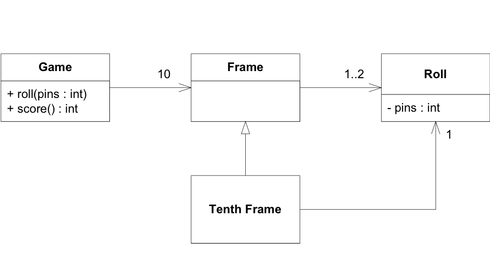

Bowling Game Kata
---
* Object Mentor, Inc.
* www.objectmentor.com
* blog.objectmentor.com

#Scoring Bowling

##Konwledge

游戏包含如上10个计分格，玩家在每个计分格有2次机会击倒10个球瓶。每局得分是击倒的球瓶数的和，
全中(一次全倒,strike)或者補中(补丢一次全倒,spare)会有额外奖励。

`关于奖励`

* 补中的奖励：10分 + 下一次丢球的得分
* 全中的奖励：10分 + 下两次丢球的得分

`关于记分`

* 上面的左右：左边为第一次丢出球得分，右边方格内为补丢球的得分。
* 下面为此计分格完毕后的累计积分。
* 最后一格丢出全中或者补中的，额外一次丢球机会。最后一格丢球次数不能超过三次。

##The Requirements
* 编写一个`Game`类以及下面两个方法
	- roll(pins:int)：每次扔求时调用，参数是丢倒的球瓶数
	- score():最后一格后计分结束调用。返回总成绩
	

##A quick design session
1. Game class
	
2. 1居有10格
	 
3. 1格可以扔1或2次
	 
4. 第十格可能有2或3次扔球机会
	 

5. 积分方法贯穿所有计分格，并且需要得出他们的总分
6. 每一格的全中和补中成绩依赖于他这格后面一格的成绩

这就是所谓的stories吧？

##Begin
* 创建BowlingGame Project，
* 然后立马建一个测试类，BowlingGameTest 

run test0

run test01

按照ppt里面的操作进行测试，测试失败，测试通过，重构，测试， 这种小粒度迭代即可

 
